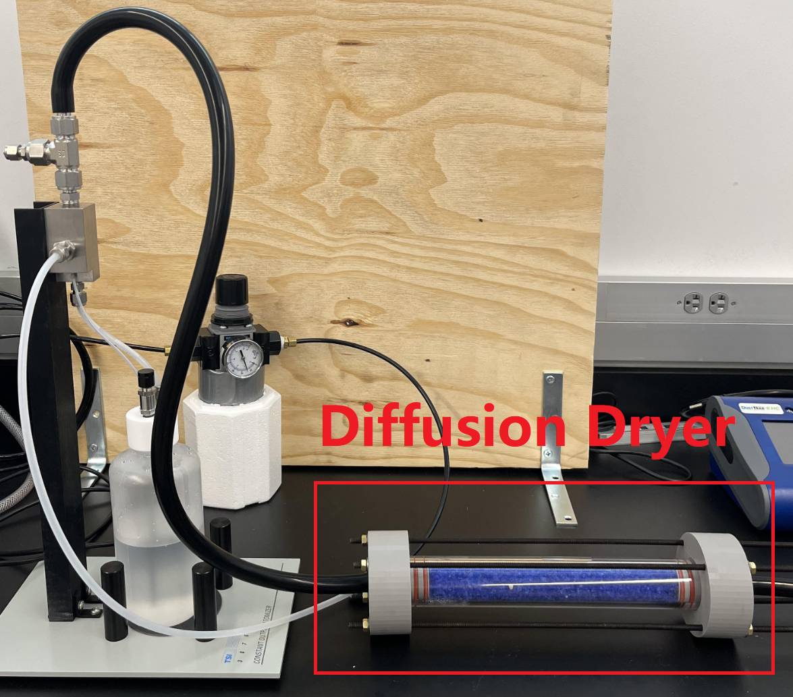

# LowCostDiffusionDryer

The diffusion dryer is a component commonly used in aerosol research to remove water vapor present in an aerosol. This type of dryer is desirable because unlike a direct desiccant dryer, a diffusion dryer can dehumidify aerosol without losing particles to the impact of the particle and the desiccant directly. The particles present in the aerosol are dried by the diffusion of water vapor from the aerosol to the desiccant, rather than from direct impact of the water vapor and desiccant, minimizing particle loss.

Commercial diffusion dryers typically cost over $3500. The price of commercial dryers present a need for a lower cost, research grade diffusion dryer. The total cost of the dryer constructed in this project was approximately $180, which is about 20 times cheaper than the leading commercial instrument. This diffusion dryer was fabricated with custom 3-D printed sealing caps and silicone rings to provide a high quality seal. Additionally, the transparent body of the dryer offers easy viewing of the desiccant status.

